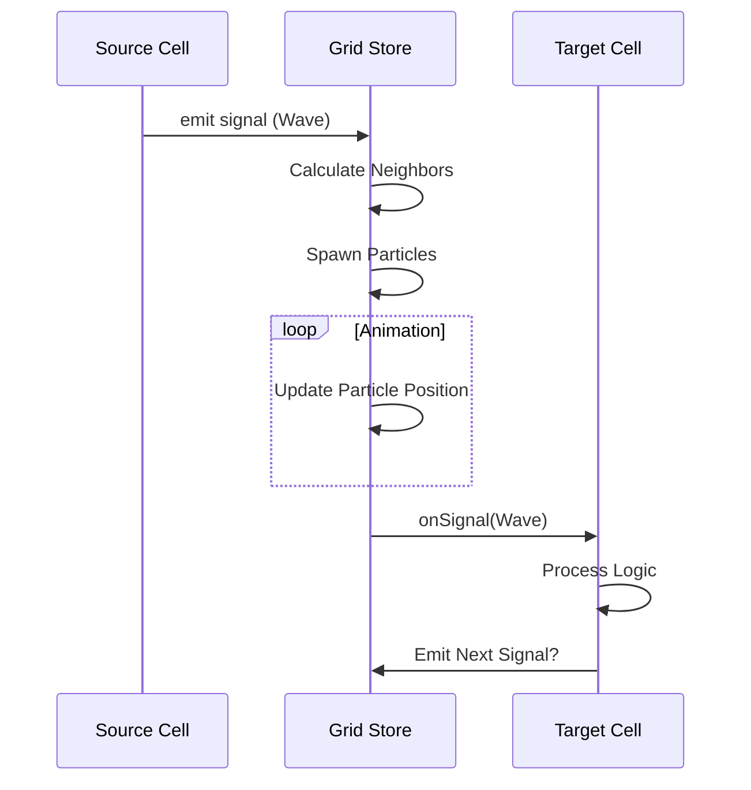

# Architecture

## High-Level Overview

**VibeManager** is a web-based "Cellular Operation System" built on **Next.js**. It simulates a hex-grid world where programmable cells interact via signal propagation.

The architecture emphasizes a **hybrid approach**:
- **React/DOM** for UI overlays, tools, and static cell rendering.
- **Canvas (Potential/Future)** for high-performance rendering of particles and signals (currently DOM/framer-motion).
- **Zustand** for centralized, reactive state management outside the React render cycle where performance matters.

```mermaid
graph TD
    User[User Interaction] --> Tools[Toolbar / Tools]
    Tools --> Store[Grid Store (Zustand)]
    Store --> Grid[Hex Grid Renderer]
    Store --> GameLoop[Simulation Loop]
    GameLoop --> Propagation[Signal System]
    Propagation --> Store
```

## Core Concepts

### 1. HexGrid System
We use an **Axial Coordinate System** (`q`, `r`) for the grid. This allows for efficient neighbor lookups and distance calculations.
- **Reference**: [Red Blob Games](https://www.redblobgames.com/grids/hexagons/)
- **File**: `app/src/core/grid/hex.ts`

### 2. PAM Architecture (Programmable Active Modules)
Every cell in the grid is an instance of a **PAM**. This is a plugin-like system that defines behavior.
- **DNA**: Static definition (name, icon, color).
- **State**: Runtime data (energy, activity, custom data).
- **Module**: The behavior implementation (`onSignal`, `onTick`).

**Structure**:
```typescript
interface PamModule {
  dna: PamDNA;
  onSpawn?: (cell) => void;
  onSignal?: (cell, signal) => void;
  onTick?: (cell, deltaTime) => void;
  configComponent?: React.Component; // UI for "Genome Inspector"
}
```

### 3. Signal Propagation
Communication happens via **Signals**.
- **Nature**: Discrete packets of data.
- **Travel**: Propagate from neighbor to neighbor.
- **Decay**: Signals have limits (range/hops).
- **Immunity**: Groups can have immunity to their own signals to prevent loops.

## Data Flow

### Signal Cycle
1. **Trigger**: A cell (e.g., Timer) or User Action creates a Signal.
2. **Dispatch**: stored in `GridStore`.
3. **Propagation Logic**: calculated in `propagation.ts`.
    - Deduplication (seenSignals).
    - Direction filtering.
    - Speed calculation.
4. **Visuals**: `Particles` are spawned to visualize the travel time.
5. **Arrival**: When particle reaches target, `onSignal` is called on the target cell.



## State Management (Zustand)
We use `zustand` with `immer`-like patterns (creating new Maps) for immutability and React reactivity.
- **`cells`**: `Map<string, Cell>` - O(1) lookup.
- **`particles`**: `Array<Particle>` - High frequency updates.
